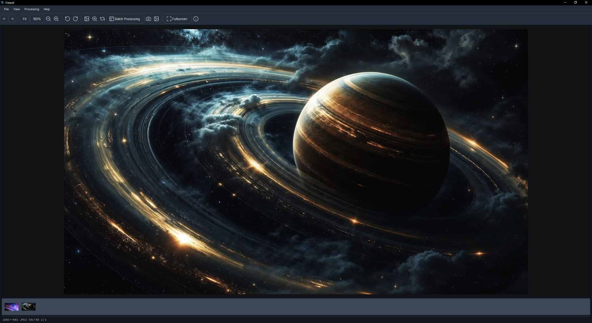
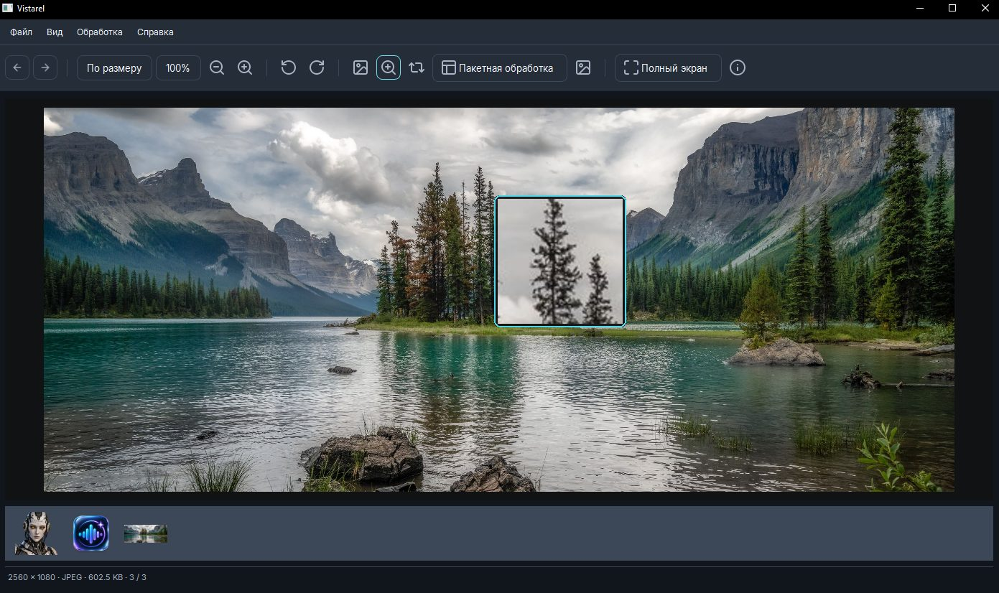
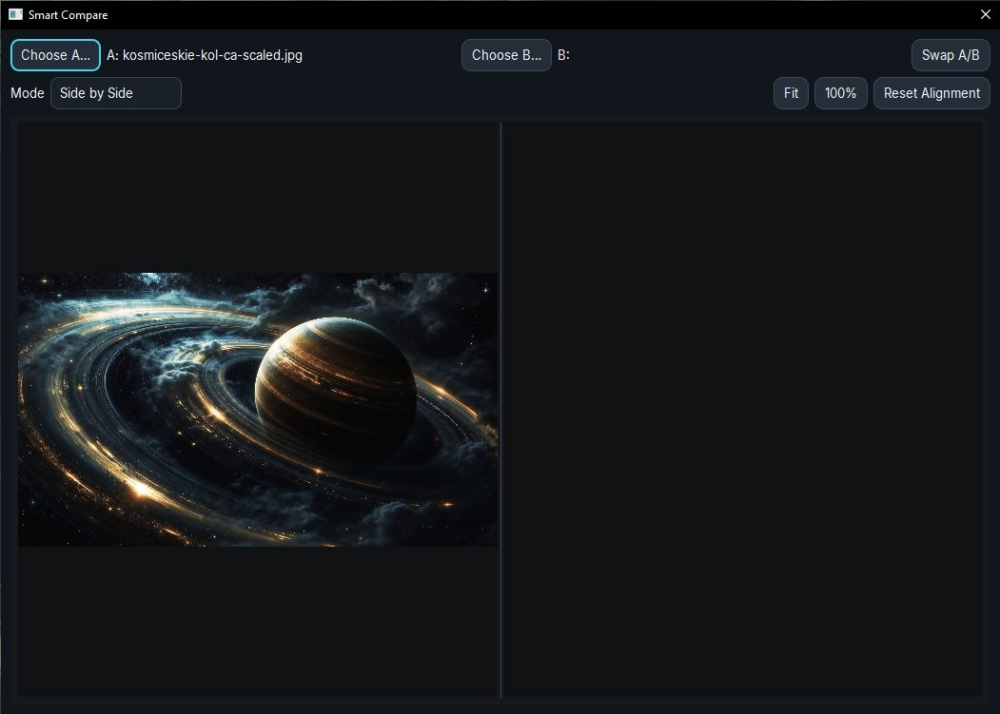
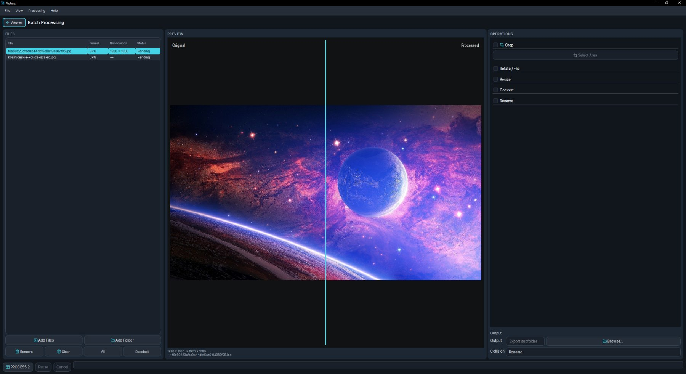
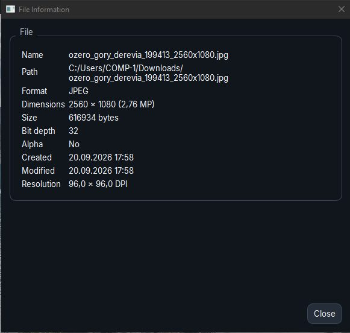

# Vistarel 1.1

**A lightweight native image viewer, comparison and batch-processing utility for Windows.**

Vistarel is built around a simple workflow:

**open → inspect → compare → process → continue in Photoshop or another app**

**Freeware · Windows 10/11 · x64 · Russian & English · No account required**

[**Download Vistarel 1.1**](https://github.com/tempchar01/Vistarel/releases/latest) · [**Support Vistarel ♥**](https://app.lava.top/tempchar)

---

## Viewer

Fast image viewing with folder navigation, thumbnails, Fit/100%, zoom, pan, rotation and fullscreen.

## Detail inspection

Use the built-in magnifier and color inspection tools without leaving the viewer.

## Compare

Compare two images side by side with synchronized viewing and alignment controls.

## Batch Processing

Process multiple files in one workflow with crop, rotate/flip, resize, convert and rename operations.

## File information

Inspect practical image details such as dimensions, file size, bit depth, resolution and color profile.

## What's new in 1.1

- Refined minimalist Graphite/Pearl interface
- Cleaner Viewer, Compare and Batch layouts
- Save As for the current image
- Screenshot capture workflow
- Improved window/application icon handling
- Compact File Information dialog
- Built-in Support Vistarel link
- General UI and interaction polish

## Highlights

- Native Windows desktop application
- Fast folder navigation and thumbnail strip
- Drag & drop
- Fit, 100%, zoom, pan and fullscreen
- Rotation
- Magnifier and color inspection
- Smart image comparison
- Batch crop, rotate, resize, convert and rename
- Save As
- Screenshot capture
- Open in Photoshop / Windows Open With integration
- Graphite, Pearl and System themes
- Russian and English interface
- Installer and portable editions
- No catalog, cloud account or heavyweight asset-management system

## Supported image formats

The current Windows build supports common formats through its bundled image runtime, including:

**JPEG · PNG · WebP · TIFF · BMP · GIF · ICO**

Export availability depends on the selected output format and the encoders available in the deployed runtime.

## Download

### Windows installer

Download the latest Setup EXE from:

[**Vistarel Releases**](https://github.com/tempchar01/Vistarel/releases/latest)

The installer adds Vistarel and Windows shortcuts and includes an uninstaller.

### Portable

Prefer not to install anything? Download the Portable ZIP, extract it to a folder and run `Vistarel.exe`.

Both editions contain the runtime components required by Vistarel; a separate Qt installation is not required.

## Support development

Vistarel is free to use. If it is useful to you, you can support its development here:

[**♥ Support Vistarel on Lava**](https://app.lava.top/tempchar)

## System requirements

- Windows 10 or Windows 11
- 64-bit Windows

## Privacy

Vistarel is designed as a local desktop application. It does not require an account to view or process local images.

## License

Vistarel is **proprietary freeware**. The compiled application may be used free of charge subject to [LICENSE.txt](LICENSE.txt).

Third-party components retain their respective licenses. See [THIRD_PARTY_NOTICES.txt](THIRD_PARTY_NOTICES.txt).

## Author

Created by **Maksim Pershikov**

Contact: **tempchar1@outlook.com**

---

Copyright © 2026 Maksim Pershikov. All rights reserved.
